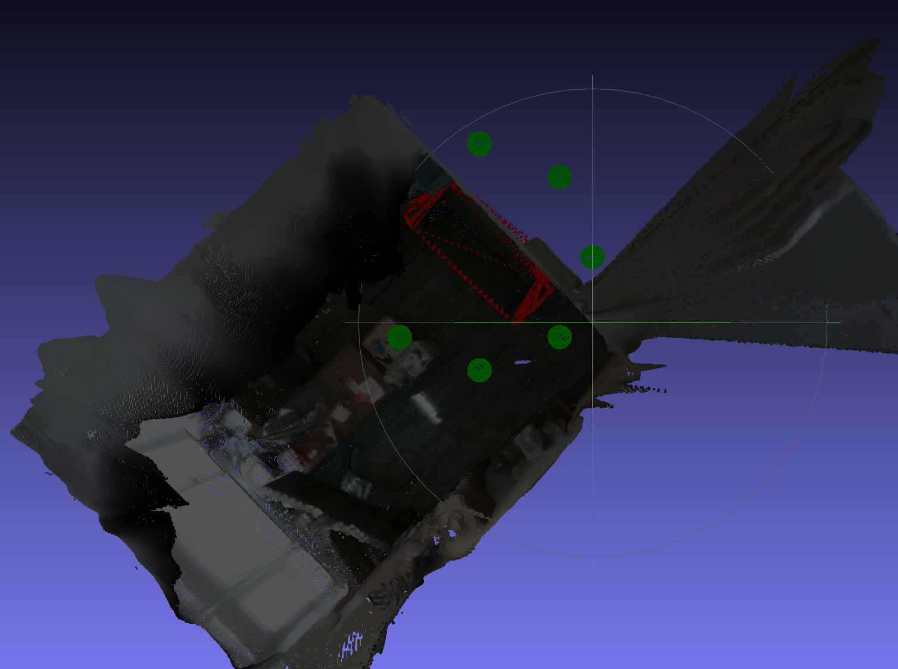

# interSeg3D-Studio

An web-based interactive 3D point cloud annotation tool, using [AGILE3D](https://github.com/ywyue/AGILE3D) for
click-based segmentation algorithm and Gemini for 3D object recognition & description.

> [!NOTE]  
> Note that this project is still in development. The current version is a prototype and may contain bugs.


## Features

- **Interactive 3D Annotation**: Easily mark and annotate objects in 3D point clouds using positive and negative clicks
- **AI-Powered Segmentation**: Click-based segmentation
  with [AGILE3D model](https://github.com/ywyue/AGILE3D)
  
- **Object Analysis**: Automatically identify and describe objects in your scene
  
- **Metadata Loading**: Import previous annotations and object information from metadata files

## Installation

### Prerequisites

- Node.js (v16 or newer)
- Python 3.10 (recommended, but should work with 3.8+)
- CUDA-compatible GPU (recommended)

### Backend Setup

1. Clone the repository:
   ```bash
   git clone https://github.com/zh-plus/interSeg3D-Studio
   cd interSeg3D-Studio
   ```

2. Install AGILE3D according to the instructions at:
   https://github.com/ywyue/AGILE3D/blob/main/installation.md
   (Dont clone the repository, just install the environment. And try to use gcc-9 & g++-9 to install MinkowskiEngine.)

3. Continue to install packages for PartField according to the instructions:
   ```bash
    pip install psutil
    pip install lightning==2.2 h5py yacs trimesh scikit-image loguru boto3 plyfile
    pip install mesh2sdf tetgen pymeshlab plyfile einops libigl polyscope potpourri3d simple_parsing arrgh open3d
    pip install --no-index torch-scatter -f https://data.pyg.org/whl/torch-1.13.1+cu116.html (replace it to your torch and cuda version)
    sudo apt install libx11-6 libgl1 libxrender1
    pip install vtk
    # You may need to install MinkowskiEngine again using https://github.com/NVIDIA/MinkowskiEngine#installation
    ```

4. Download the pre-trained model weights for Agile3D from:
   https://polybox.ethz.ch/index.php/s/RnB1o8X7g1jL0lM, and put it into the `src/backend/agile3d/weights` directory.

5. Download the pre-trained model weights for PartField from:
   https://huggingface.co/mikaelaangel/partfield-ckpt/resolve/main/model_objaverse.ckpt, and put it into the
   `src/backend/partfield/weights` directory.

6. Create a `.env` file in the `src/backend` directory with:

   ```
   GOOGLE_API_KEY='your_google_api_key'  # For object recognition
   ```

#### Tested Deps

```
torch==1.13.1+cu116
pytorch-lightning==2.2.5
torchmetrics==1.5.2
numpy==1.26.4
```

### Frontend Setup

1. Install Node.js dependencies:
   ```bash
   cd src/frontend
   npm install
   ```

2. Create a `.env` file in the `src/frontend` directory with:
   ```
   VITE_API_BASE_URL=http://localhost:9500
   VITE_USE_PROXY=true
   ```

## Running the Application

1. Start the backend server:
   ```bash
   cd src/backend
   python app.py
   ```

2. In a new terminal, start the frontend development server:
   ```bash
   cd src/frontend
   npm run dev
   ```

3. Open your browser and navigate to:
   ```
   http://localhost:3001
   ```

## Usage Guide

### Interaction Modes

The application has three main interaction modes:

1. **Navigate Mode**: Rotate, pan, and zoom the view
2. **Annotate Mode**: Mark points on objects or background
3. **Select Mode**: Select and edit segmented objects

### Basic Workflow

1. **Upload** a PLY file using the file upload panel
2. **Load metadata** to import previous annotations and object information (optional)
3. **Create objects** by entering names and clicking "Create Object"
4. **Select an object** from the list and switch to "Annotation Mode"
5. **Mark points** on the object by clicking on the point cloud
6. **Mark background** by switching to "Background" mode and clicking non-object areas
7. **Run segmentation** by clicking the "RUN SEGMENTATION" button
8. **(Optional) Analyze objects** to automatically identify and describe them (remember to click `APPLY LABEL` or
   `APPLY ALL RESULTS`)
9. **Switch to Select Mode** to click on segmented objects and edit their labels and descriptions
10. **Save results** to download the segmented point cloud and metadata

### Keyboard Shortcuts

- **A**: Toggle between navigation and annotation modes
- **S**: Activate select mode
- **Enter**: Run segmentation
- **N**: Create a new object with default name "new obj"
- **Ctrl+Z**: Undo the last click
- **Shift+Ctrl+Z**: Redo an undone click
- **Ctrl+S**: Save object information

### Mouse Controls

- **Left-click + drag** (Navigation Mode): Rotate the view
- **Right-click + drag**: Pan the view
- **Scroll wheel**: Zoom in/out
- **Left-click** (Annotation Mode): Mark a point
- **Left-click** (Select Mode): Select an object to edit its label and description

## How it works

After segmenting the project interactively using clicks, all the objects are scanned from multiple angles and analyzed
using the AI object recognition model. The model uses the LLM API to identify the objects and provide a description of
the object. The description includes the object's name, color, and size.

For example, the object are indicated using convex hulls and the cameras are positioned at green spheres.



## Development

### Project Structure

```
├── package.json
├── src
│   ├── backend
│   │   ├── agile3d               # Interactive Segmentation Model
│   │   ├── app.py                # FastAPI server
│   │   ├── inference.py          # Segmentation model
│   │   ├── view_rendering.py     # View generation
│   │   └── visual_obj_recognition.py  # AI object recognition
│   └── frontend
│       ├── App.vue               # Main application component
│       ├── components            # Vue components
│       ├── composables           # Vue composition functions
│       ├── services              # Service layer
│       ├── types                 # TypeScript type definitions
│       └── utils                 # Utility functions
```

## Contributing

1. Fork the repository
2. Create your feature branch (`git checkout -b feature/amazing-feature`)
3. Commit your changes (`git commit -m 'Add some amazing feature'`)
4. Push to the branch (`git push origin feature/amazing-feature`)
5. Open a Pull Request

## License

This project is licensed under the MIT License - see the LICENSE file for details.

## Acknowledgments

- [AGILE3D](https://github.com/ywyue/AGILE3D) for the segmentation models
- [Three.js](https://threejs.org/) for 3D rendering capabilities
- [Open3D](http://www.open3d.org/) for point cloud processing