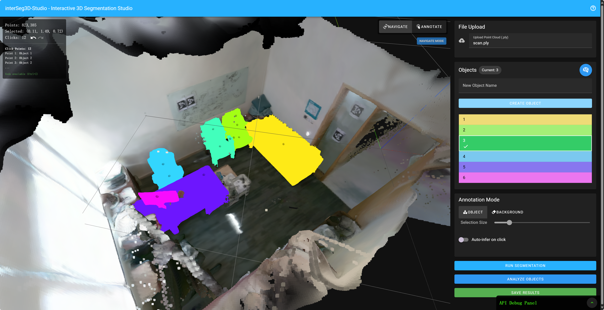

# interSeg3D-Studio

An web-based interactive 3D point cloud segmentation and annotation tool with AI-powered object detection.



## Features

- **Interactive 3D Annotation**: Easily mark and annotate objects in 3D point clouds
- **AI-Powered Segmentation**: One-click segmentation
  with [advanced deep learning models](https://github.com/ywyue/AGILE3D)
- **Object Analysis**: Automatically identify and describe objects in your scene


## Installation

### Prerequisites

- Node.js (v16 or newer)
- Python 3.10 (recommended, but should work with 3.8+)
- CUDA-compatible GPU (recommended)

### Backend Setup

1. Clone the repository:
   ```bash
   git clone https://github.com/zh-plus/interSeg3D-Studio
   cd interSeg3D-Studio
   ```

2. Install AGILE3D according to the instructions at:
   https://github.com/ywyue/AGILE3D/blob/main/installation.md

3. Download the pre-trained model weights from:
   https://polybox.ethz.ch/index.php/s/RnB1o8X7g1jL0lM, and put it into the `src/backend/agile3d/weights` directory.

4. Create a `.env` file in the `src/backend` directory with:

   ```
   GOOGLE_API_KEY='your_google_api_key'  # For object detection
   ```

### Frontend Setup

1. Install Node.js dependencies:
   ```bash
   cd src/frontend
   npm install
   ```

2. Create a `.env` file in the `src/frontend` directory with:
   ```
   VITE_API_BASE_URL=http://localhost:9500
   VITE_USE_PROXY=true
   ```

## Running the Application

1. Start the backend server:
   ```bash
   python src/backend/app.py
   ```

2. In a new terminal, start the frontend development server:
   ```bash
   cd src/frontend
   npm run dev
   ```

3. Open your browser and navigate to:
   ```
   http://localhost:3001
   ```

## Usage Guide

### Basic Workflow

1. **Upload** a PLY file using the file upload panel
2. **Create objects** by entering names and clicking "Create Object"
3. **Select an object** from the list and switch to "Annotation Mode"
4. **Mark points** on the object by clicking on the point cloud
5. **Mark background** by switching to "Background" mode and clicking non-object areas
6. **Run segmentation** by clicking the "RUN SEGMENTATION" button
7. **Analyze objects** to automatically identify and describe them
8. **Save results** to download the segmented point cloud

### Keyboard Shortcuts

- **A**: Toggle between navigation and annotation modes
- **Ctrl+Z**: Undo the last click
- **Shift+Ctrl+Z**: Redo an undone click

### Mouse Controls

- **Left-click + drag** (Navigation Mode): Rotate the view
- **Right-click + drag**: Pan the view
- **Scroll wheel**: Zoom in/out
- **Left-click** (Annotation Mode): Mark a point

## Development

### Project Structure

```
├── package.json
├── src
│   ├── backend
│   │   ├── agile3d               # Interactive Segmentation Model
│   │   ├── app.py                # FastAPI server
│   │   ├── inference.py          # Segmentation model
│   │   ├── view_rendering.py     # View generation
│   │   └── visual_obj_detection.py  # AI object detection
│   └── frontend
│       ├── App.vue               # Main application component
│       ├── components            # Vue components
│       ├── composables           # Vue composition functions
│       ├── services              # Service layer
│       ├── types                 # TypeScript type definitions
│       └── utils                 # Utility functions
```

## Contributing

1. Fork the repository
2. Create your feature branch (`git checkout -b feature/amazing-feature`)
3. Commit your changes (`git commit -m 'Add some amazing feature'`)
4. Push to the branch (`git push origin feature/amazing-feature`)
5. Open a Pull Request

## License

This project is licensed under the MIT License - see the LICENSE file for details.

## Acknowledgments

- [AGILE3D](https://github.com/ywyue/AGILE3D) for the segmentation models
- [Three.js](https://threejs.org/) for 3D rendering capabilities
- [Open3D](http://www.open3d.org/) for point cloud processing